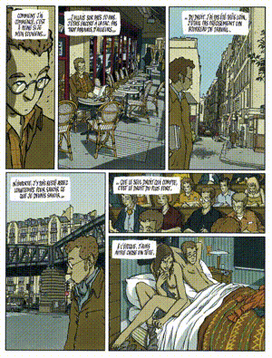
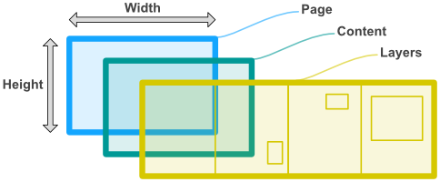
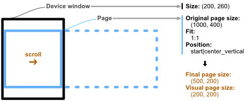

# BDCoMa

There are mainly 3 types of books:

Traditional (with eventually transition between pages)  |  Scrollable (with eventually parallax effects)  |  Turbomedia (animated slideshow)
:------------------------------------------------------:|:-----------------------------------------------:|:-------------------------------:
 |  | 

Here is a suggestion of manifest specifications, in relation with the [EDRLab Working group](https://github.com/edrlab/bd-comics-manga), and an illustration of the implementation for each of this book type.

- **[Manifest](manifest.md)**
- **Example of implementation:**
   - [Traditional book](examples/LeTueur/manifest.md)
   - [Scrollable book](examples/BrothersBond2/manifest.md)
   - Turbomedia
- **Other platforms implementation:**
   - [Madefire *(example of a turbomedia)*](others/Madefire/index.md)
   - [Webtoon *(example of a scrollable book)*](others/Webtoon/episodeInfo.md)

## Notes

### Guided navigation

*In reference to [Structure - root](https://github.com/edrlab/bd-comics-manga/blob/master/Structure.md#root)*

If the guided navigation is seen as a rendition, it is thus impossible to start this mode from any page.
Moreover, the guided navigation probably depends on the size of the screen (smartphone, tablet, portrait, landscape...).  
For these reasons, I think that the notion of "guided" should not exists as a rendition and instead, the description of the page (in the form of [Fragments](manifest.md#fragment) in the properties of a [Page](manifest.md#page)) should be provided to let the user-agent decide how to guide the user.  
  
See [Page](manifest.md#page) in the [manifest](manifest.md).

### Page

#### Parallax / Layers

*In reference to [Structure - page/fragment](https://github.com/edrlab/bd-comics-manga/blob/master/Structure.md#pagefragment)*

A page may contains layers without parallax (in turbomedia for instance).  
So I suggest removing the key "parallax" and directly list the layers.  
  
See [Page](manifest.md#page) in the [manifest](manifest.md).

#### Scroll / Images

*In reference to:*
- *[Scroll](https://github.com/edrlab/bd-comics-manga/blob/master/Scroll.md)*
- *[Structure - page/fragment](https://github.com/edrlab/bd-comics-manga/blob/master/Structure.md#pagefragment)*
- *[Structure - page properties](https://github.com/edrlab/bd-comics-manga/blob/master/Structure.md#page-properties)*

The scroll can't be determine by the image size and the fit property:
- May be the author intentionally provided a large background image to manage different window ratios
- It shouldn't be mandatory to provide the couple (`type`, `href`) if we just want layers (it could be the case in webtoons for instance: the large/tall image can be tiled in several small pieces and each piece of this image is then distributed in layers). In this case, it would be difficult to know how to present the page.

Consequently, I propose modifying the page structure like this:
> {  
>      "width": [@uint](manifest.md#uint),  
>      "height": [@uint](manifest.md#uint),  
>      "fit": [@fitType](manifest.md#fittype),  
>      "position": [@positionMask](manifest.md#positionmask),  
>      "content": {  
>           "type": [@resourceType](manifest.md#resourcetype),  
>           "href": "*`Path to resource`*",  
>           "width": [@uint](manifest.md#uint),  
>           "height": [@uint](manifest.md#uint),  
>           "fit": [@fitType](manifest.md#fittype),  
>           "position": [@positionMask](manifest.md#positionmask)  
>      },  
>      "layers": [  
>           [**@Layer**](manifest.md#layer)  
>      ],  
>      ...  
> }

*(For a complete description, see [Page structure](manifest.md#page)).*  
  
This way, a page is visually defined by its size (`width`, `height`), a resource (`content`) and layers (`layers`) on top of it.  
  
  
The behaviour of this page inside the window (final size, position, scroll...) is determined by its original size, plus the `fit` and `position` parameters.  
  
  
For more information, see [Page](manifest.md#page).

### Animations

With `gif` or `apng` images (not supported natively by every platform) it would be possible to make animations like the ones in the turbomedia example provided at the top. But in such a case, making a `gif` or `apng` image is like making a video and can lead to heavy files. May be it could be useful, as they did in this example, to be able to animate layers.  
So here is a suggestion of how to animate a [Layer](manifest.md#layer) with [Animations](manifest.md#animation).

### Background

Studying what the others do in their proprietary format, I have notice the need of gradient background. I have thus suggested a way to integrate them in our format.  
  
See [Background](manifest.md#background) in the [manifest](manifest.md).