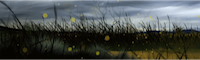
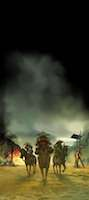
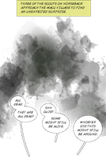

# Scrollable book example

Example of a scrollable book with animations, adapted from this:  
  

## Manifest

*`(Original version: `[`manifest.json`](manifest.json)`)`*

{  
    "@context": "https://readium.org/webpub-manifest/context.jsonld",  
  
    "metadata": {  
        "@type": "http://schema.org/Book",  
        "title": "Ep. 2",  
        "identifier": "urn:webtoons:1191",  
        "language": "en",  
        "modificationDate": "2017-11-08T07:05:05Z",  
        "publicationDate": "2017-11-08T07:51:51Z",  
        "series": {  
            "name": "Brothers Bond"  
        },  
        "contributors": {  
            "author": [  
                {  
                    "name": "Kevin Grevioux"  
                }  
            ],  
            "illustrator": [  
                {  
                    "name": "Ryan Benjamin"  
                }  
            ]  
        },  
        "publisher": {  
            "name": "Webtoon"  
        },  
        "readingProgression": "ttb",  
        "numberOfPages": 1,  
        "position": 3,  
        "description": "Young prince Yoshi is sent to train in self defence but has other plans.",  
        "cover": {  
            "href": "[cover.png](cover.png)" ,  
            "type": "image/png",  
            "width": 1040,  
            "height": 250  
        }  
    },  
  
    "spine": [  
        {  
            "width": 800,  
            "height": 24003,  
            "fit": "width",  
            "position": "top",  
            "properties": {  
                "background": {  
                    "color": "#ffffff"  
                }  
            },  
            "layers": [  
                {  
                    "width": 800,  
                    "height": 1280,  
                    "speed": 1,  
                    "path": "M 0,0",  
                    "resources": [  
                        {  
                            "type": "image/jpeg",  
                            "href": "[layerws528ac0a.jpg](images/layerws528ac0a.jpg)"   
                        }  
                    ]  
                },  
                {  
                    "width": 800,  
                    "height": 241,  
                    "speed": 1,  
                    "path": "M 0,1037",  
                    "opacity": 0,  
                    "resources": [  
                        {  
                            "type": "image/png",  
                            "href": "[v0l9owrjb1.png](images/v0l9owrjb1.png)"   
                        }  
                    ],  
                    "animations": [  
                        {  
                            "start": {  
                                "position": {  
                                    "y": 1800  
                                }  
                            },  
                            "end": {  
                                "y": 2000  
                            },  
                            "sequence": [  
                                {  
                                    "from": {  
                                        "opacity": 0  
                                    },  
                                    "to": {  
                                        "opacity": 1  
                                    }  
                                }  
                            ]  
                        }  
                    ]  
                },  
                {  
                    "width": 381,  
                    "height": 88,  
                    "speed": 1,  
                    "path": "M 16,965",  
                    "resources": [  
                        {  
                            "type": "image/png",  
                            "href": "[v0l9owrjb0.png](images/v0l9owrjb0.png)"   
                        }  
                    ]  
                },  
  
                {  
                    "width": 800,  
                    "height": 1102,  
                    "speed": 1,  
                    "path": "M 0,1278",  
                    "resources": [  
                        {  
                            "type": "image/jpeg",  
                            "href": "[layergn6eibtmk.jpg](images/layergn6eibtmk.jpg)"   
                        }  
                    ]  
                },  
  
                {  
                    "width": 800,  
                    "height": 1800,  
                    "speed": 1,  
                    "path": "M 0,2378",  
                    "resources": [  
                        {  
                            "type": "image/jpeg",  
                            "href": "[layer0ahxxmlc5.jpg](images/layer0ahxxmlc5.jpg)"   
                        }  
                    ]  
                },  
                {  
                    "width": 1274,  
                    "height": 414,  
                    "speed": 1,  
                    "path": "M -474,3803",  
                    "resources": [  
                        {  
                            "type": "image/png",  
                            "href": "[bvzld1g3p1.png](images/bvzld1g3p1.png)"   
                        }  
                    ],  
                    "animations": [  
                        {  
                            "start": {  
                                "position": {  
                                    "y": 4117  
                                }  
                            },  
                            "end": {  
                                "x": 4300  
                            },  
                            "sequence": [  
                                {  
                                    "from": {  
                                        "translation.x": 0,  
                                        "translation.y": 0  
                                    },  
                                    "to": {  
                                        "translation.x": 72,  
                                        "translation.y": 3  
                                    }  
                                }  
                            ]  
                        }  
                    ]  
                },  
                {  
                    "width": 800,  
                    "height": 1196,  
                    "speed": 1,  
                    "path": "M 0,2650",  
                    "resources": [  
                        {  
                            "type": "image/png",  
                            "href": "[bvzld1g3p0.png](images/bvzld1g3p0.png)"   
                        }  
                    ],  
                    "animations": [  
                        {  
                            "start": {  
                                "position": {  
                                    "y": 3200  
                                }  
                            },  
                            "end": {  
                                "x": 4100  
                            },  
                            "sequence": [  
                                {  
                                    "from": {  
                                        "translation.x": 0,  
                                        "translation.y": 0  
                                    },  
                                    "to": {  
                                        "translation.x": -2,  
                                        "translation.y": -270  
                                    }  
                                }  
                            ]  
                        }  
                    ]  
                }  
            ]  
        }  
    ],  
  
    "sections": [],  
  
    "renditions": [],  
  
    "resources": [],  
  
    "links": []  
}  