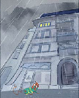

# Scrollable book example (2)

Example of a scrollable book with snap points and animations:  
  

## Manifest

*`(Original version: `[`manifest.json`](manifest.json)`)`*

{  
     "@context": "https://readium.org/webpub-manifest/context.jsonld",  
  
     "metadata": {  
          "@type": "http://schema.org/Book",  
          "title": "Electrozz",  
          "identifier": "urn:stripop:electrozz",  
          "language": "fr",  
          "contributors": {  
               "author": [  
                    {  
                         "name": "Philippe Rolland"  
                    }  
               ],  
               "illustrator": [  
                    {  
                         "name": "Morgane Mattard"  
                    },  
                    {  
                         "name": "Noémie Szmrzsik"  
                    }  
               ]  
          },  
          "publisher": {  
               "name": "Stripop"  
          },  
          "readingProgression": "ltr",  
          "numberOfPages": 1,  
          "description": "Electrozz est une histoire courte, humoristique, racontant les mésaventures d'un jeune homme qui drague sa voisine mais qui va voir ses plans bouleversés par le pouvoir foudroyant de la souris électrique. Electrozz est une bande-dessinée horizontale composée de 5 bandes d'une quinzaine de cases chacune.",  
          "cover": {  
               "href": "[cover.jpg](cover.jpg)" ,  
               "type": "image/jpeg",  
               "width": 410,  
               "height": 587  
          }  
     },  
  
     "spine": [  
          {  
               "width": 5012,  
               "height": 600,  
               "fit": "4:3",  
               "position": "center",  
               "content": {  
                    "type": "image/jpeg",  
                    "href": "[images/background.jpg](images/background.jpg)" ,  
                    "width": 800,  
                    "height": 600,  
                    "fit": "height",  
                    "position": "top|start"  
               },  
               "properties": {  
                    "snap-points": [  
                         {  
                              "identifier": "snap-1",  
                              "x": 400,  
                              "alignment": "center"  
                         },  
                         {  
                              "identifier": "snap-2",  
                              "x": 586,  
                              "alignment": "center"  
                         },  
                         {  
                              "identifier": "snap-3",  
                              "x": 810,  
                              "alignment": "center"  
                         },  
                         {  
                              "identifier": "snap-4",  
                              "x": 1116,  
                              "alignment": "center"  
                         },  
                         {  
                              "identifier": "snap-5",  
                              "x": 1449.5,  
                              "alignment": "center"  
                         },  
                         {  
                              "identifier": "snap-6",  
                              "x": 1751.5,  
                              "alignment": "center"  
                         },  
                         {  
                              "identifier": "snap-7",  
                              "x": 2029.8125,  
                              "alignment": "center"  
                         },  
                         {  
                              "identifier": "snap-8",  
                              "x": 2278,  
                              "alignment": "center"  
                         },  
                         {  
                              "identifier": "snap-9",  
                              "x": 2522.5,  
                              "alignment": "center"  
                         },  
                         {  
                              "identifier": "snap-10",  
                              "x": 2803.5,  
                              "alignment": "center"  
                         },  
                         {  
                              "identifier": "snap-11",  
                              "x": 3110.5,  
                              "alignment": "center"  
                         },  
                         {  
                              "identifier": "snap-12",  
                              "x": 3420,  
                              "alignment": "center"  
                         },  
                         {  
                              "identifier": "snap-13",  
                              "x": 3683,  
                              "alignment": "center"  
                         },  
                         {  
                              "identifier": "snap-14",  
                              "x": 3926.5,  
                              "alignment": "center"  
                         },  
                         {  
                              "identifier": "snap-15",  
                              "x": 4155,  
                              "alignment": "center"  
                         },  
                         {  
                              "identifier": "snap-16",  
                              "x": 4377.5,  
                              "alignment": "center"  
                         },  
                         {  
                              "identifier": "snap-17",  
                              "x": 4612.3,  
                              "alignment": "center"  
                         }  
                    ]  
               }  
               "layers": [  
                    {  
                         "width": 219,  
                         "height": 270,  
                         "path": "M 290.5,177.5",  
                         "speed": 1,  
                         "resources": [  
                              {  
                                   "type": "image/jpeg",  
                                   "href": "images/01.jpg#0,0,219,270"  ,  
                                   "duration": 80  
                              },  
                              {  
                                   "type": "image/jpeg",  
                                   "href": "images/01.jpg#219,0,438,270"  ,  
                                   "duration": 80  
                              },  
                              {  
                                   "type": "image/jpeg",  
                                   "href": "images/01.jpg#438,0,657,270"  ,  
                                   "duration": 80  
                              },  
                              {  
                                   "type": "image/jpeg",  
                                   "href": "images/01.jpg#657,0,876,270"  ,  
                                   "duration": 80  
                              },  
                              {  
                                   "type": "image/jpeg",  
                                   "href": "images/01.jpg#876,0,1095,270"  ,  
                                   "duration": 80  
                              },  
                              {  
                                   "type": "image/jpeg",  
                                   "href": "images/01.jpg#1095,0,1314,270"  ,  
                                   "duration": 80  
                              },  
                              {  
                                   "type": "image/jpeg",  
                                   "href": "images/01.jpg#1314,0,1533,270"  ,  
                                   "duration": 80  
                              },  
                              {  
                                   "type": "image/jpeg",  
                                   "href": "images/01.jpg#1533,0,1752,270"  ,  
                                   "duration": 80  
                              },  
                              {  
                                   "type": "image/jpeg",  
                                   "href": "images/01.jpg#1752,0,1971,270"  ,  
                                   "duration": 80  
                              },  
                              {  
                                   "type": "image/jpeg",  
                                   "href": "images/01.jpg#1971,0,2190,270"  ,  
                                   "duration": 80  
                              },  
                              {  
                                   "type": "image/jpeg",  
                                   "href": "images/01.jpg#2190,0,2409,270"  ,  
                                   "duration": 80  
                              },  
                              {  
                                   "type": "image/jpeg",  
                                   "href": "images/01.jpg#2409,0,2628,270"  ,  
                                   "duration": 80  
                              }  
                         ],  
                         "loops": 0  
                    },  
                    {  
                         "width": 133,  
                         "height": 270,  
                         "path": "M 519.5,177.5",  
                         "speed": 1,  
                         "resources": [  
                              {  
                                   "type": "image/jpeg",  
                                   "href": "[images/02.jpg](images/02.jpg)"   
                              }  
                         ]  
                    },  
                    {  
                         "width": 295,  
                         "height": 270,  
                         "path": "M 662.5,177.5",  
                         "speed": 1,  
                         "resources": [  
                              {  
                                   "type": "image/jpeg",  
                                   "href": "[images/03.jpg](images/03.jpg)"   
                              }  
                         ]  
                    },  
                    {  
                         "width": 297,  
                         "height": 270,  
                         "path": "M 967.5,177.5",  
                         "speed": 1,  
                         "resources": [  
                              {  
                                   "type": "image/jpeg",  
                                   "href": "[images/04.jpg](images/04.jpg)"   
                              }  
                         ]  
                    },  
                    {  
                         "width": 350,  
                         "height": 270,  
                         "path": "M 1274.5,177.5",  
                         "speed": 1,  
                         "resources": [  
                              {  
                                   "type": "image/jpeg",  
                                   "href": "[images/05.jpg](images/05.jpg)"   
                              }  
                         ]  
                    },  
                    {  
                         "width": 314,  
                         "height": 154,  
                         "path": "M 1274.5,177.5",  
                         "speed": 1,  
                         "opacity": 0,  
                         "scale": {  
                              "x": 0.75,  
                              "y": 0.75  
                         },  
                         "resources": [  
                              {  
                                   "type": "image/png",  
                                   "href": "[images/05-bubble.png](images/05-bubble.png)"   
                              }  
                         ],  
                         "animations": [  
                              {  
                                   "start": {  
                                        "snap-point": "snap-5"  
                                   },  
                                   "duration": 1000,  
                                   "sequence": [  
                                        {  
                                             "from": {  
                                                  "opacity": 0,  
                                                  "translation.y": 0  
                                             },  
                                             "to": {  
                                                  "opacity": 1,  
                                                  "translation.y": 24  
                                             }  
                                        }  
                                   ]  
                              }  
                         ]  
                    },  
                    {  
                         "width": 234,  
                         "height": 270,  
                         "path": "M 1634.5,177.5",  
                         "speed": 1,  
                         "resources": [  
                              {  
                                   "type": "image/jpeg",  
                                   "href": "[images/06.jpg](images/06.jpg)"   
                              }  
                         ]  
                    },  
                    {  
                         "width": 302.625,  
                         "height": 270,  
                         "path": "M 1878.5,177.5",  
                         "speed": 1,  
                         "resources": [  
                              {  
                                   "type": "image/jpeg",  
                                   "href": "[images/07#0,0,302.625,270.jpg](images/07#0,0,302.625,270.jpg)"  ,  
                                   "duration": 80  
                              },  
                              {  
                                   "type": "image/jpeg",  
                                   "href": "[images/07#302.625,0,605.25,270.jpg](images/07#302.625,0,605.25,270.jpg)"  ,  
                                   "duration": 80  
                              },  
                              {  
                                   "type": "image/jpeg",  
                                   "href": "[images/07#605.25,0,907.875,270.jpg](images/07#605.25,0,907.875,270.jpg)"  ,  
                                   "duration": 80  
                              },  
                              {  
                                   "type": "image/jpeg",  
                                   "href": "[images/07#907.875,0,1210.5,270.jpg](images/07#907.875,0,1210.5,270.jpg)"  ,  
                                   "duration": 80  
                              },  
                              {  
                                   "type": "image/jpeg",  
                                   "href": "[images/07#1210.5,0,1513.125,270.jpg](images/07#1210.5,0,1513.125,270.jpg)"  ,  
                                   "duration": 80  
                              },  
                              {  
                                   "type": "image/jpeg",  
                                   "href": "[images/07#1513.125,0,1815.75,270.jpg](images/07#1513.125,0,1815.75,270.jpg)"  ,  
                                   "duration": 80  
                              },  
                              {  
                                   "type": "image/jpeg",  
                                   "href": "[images/07#1815.75,0,2118.375,270.jpg](images/07#1815.75,0,2118.375,270.jpg)"  ,  
                                   "duration": 80  
                              },  
                              {  
                                   "type": "image/jpeg",  
                                   "href": "[images/07#2118.375,0,2421,270.jpg](images/07#2118.375,0,2421,270.jpg)"  ,  
                                   "duration": 80  
                              }  
                         ],  
                         "loops": 1  
                    },  
                    {  
                         "width": 192,  
                         "height": 270,  
                         "path": "M 2182,177.5",  
                         "speed": 1,  
                         "resources": [  
                              {  
                                   "type": "image/jpeg",  
                                   "href": "[images/08.jpg](images/08.jpg)"   
                              }  
                         ]  
                    },  
                    {  
                         "width": 277,  
                         "height": 270,  
                         "path": "M 2384,177.5",  
                         "speed": 1,  
                         "resources": [  
                              {  
                                   "type": "image/jpeg",  
                                   "href": "[images/09.jpg](images/09.jpg)"   
                              }  
                         ]  
                    },  
                    {  
                         "width": 265,  
                         "height": 270,  
                         "path": "M 2671,177.5",  
                         "speed": 1,  
                         "resources": [  
                              {  
                                   "type": "image/jpeg",  
                                   "href": "[images/10.jpg](images/10.jpg)"   
                              }  
                         ]  
                    },  
                    {  
                         "width": 329,  
                         "height": 270,  
                         "path": "M 2946,177.5",  
                         "speed": 1,  
                         "resources": [  
                              {  
                                   "type": "image/jpeg",  
                                   "href": "[images/11.jpg](images/11.jpg)"   
                              }  
                         ]  
                    },  
                    {  
                         "width": 270,  
                         "height": 270,  
                         "path": "M 3285,177.5",  
                         "speed": 1,  
                         "resources": [  
                              {  
                                   "type": "image/jpeg",  
                                   "href": "[images/12.jpg](images/12.jpg)"   
                              }  
                         ]  
                    },  
                    {  
                         "width": 236,  
                         "height": 270,  
                         "path": "M 3565,177.5",  
                         "speed": 1,  
                         "resources": [  
                              {  
                                   "type": "image/jpeg",  
                                   "href": "images/13.jpg#0,0,236,270"  ,  
                                   "duration": 80  
                              },  
                              {  
                                   "type": "image/jpeg",  
                                   "href": "images/13.jpg#236,0,472,270"  ,  
                                   "duration": 80  
                              },  
                              {  
                                   "type": "image/jpeg",  
                                   "href": "images/13.jpg#472,0,708,270"  ,  
                                   "duration": 80  
                              }  
                         ],  
                         "loops": 0  
                    },  
                    {  
                         "width": 239,  
                         "height": 182,  
                         "path": "M 3619,325",  
                         "speed": 1,  
                         "scale": {  
                              "x": 0.76,  
                              "y": 0.76  
                         },  
                         "resources": [  
                              {  
                                   "type": "image/png",  
                                   "href": "[images/13-bubble.png](images/13-bubble.png)"   
                              }  
                         ],  
                         "animations": [  
                              {  
                                   "start": {  
                                        "snap-point": "snap-13"  
                                   },  
                                   "duration": 1000,  
                                   "sequence": [  
                                        {  
                                             "from": {  
                                                  "opacity": 0,  
                                             },  
                                             "to": {  
                                                  "opacity": 1  
                                             }  
                                        }  
                                   ]  
                              }  
                         ]  
                    },  
                    {  
                         "width": 231,  
                         "height": 270,  
                         "path": "M 3811,177.5",  
                         "speed": 1,  
                         "resources": [  
                              {  
                                   "type": "image/jpeg",  
                                   "href": "[images/14.jpg](images/14.jpg)"   
                              }  
                         ]  
                    },  
                    {  
                         "width": 206,  
                         "height": 270,  
                         "path": "M 4052,177.5",  
                         "speed": 1,  
                         "resources": [  
                              {  
                                   "type": "image/jpeg",  
                                   "href": "images/15.jpg#0,0,206,270"  ,  
                                   "duration": 80  
                              },  
                              {  
                                   "type": "image/jpeg",  
                                   "href": "images/15.jpg#206,0,412,270"  ,  
                                   "duration": 80  
                              }  
                         ],  
                         "loops": 0  
                    },  
                    {  
                         "width": 312,  
                         "height": 84,  
                         "path": "M 4052,177.5",  
                         "speed": 1,  
                         "scale": {  
                              "x": 0.66,  
                              "y": 0.66  
                         },  
                         "resources": [  
                              {  
                                   "type": "image/png",  
                                   "href": "[images/15-bubble.png](images/15-bubble.png)"   
                              }  
                         ],  
                         "animations": [  
                              {  
                                   "start": {  
                                        "snap-point": "snap-15"  
                                   },  
                                   "duration": 1000,  
                                   "sequence": [  
                                        {  
                                             "from": {  
                                                  "opacity": 0,  
                                             },  
                                             "to": {  
                                                  "opacity": 1  
                                             }  
                                        }  
                                   ]  
                              }  
                         ]  
                    },  
                    {  
                         "width": 219,  
                         "height": 270,  
                         "path": "M 4268,177.5",  
                         "speed": 1,  
                         "resources": [  
                              {  
                                   "type": "image/jpeg",  
                                   "href": "[images/16.jpg](images/16.jpg)"   
                              }  
                         ]  
                    },  
                    {  
                         "width": 230.6,  
                         "height": 270,  
                         "path": "M 4497,177.5",  
                         "speed": 1,  
                         "resources": [  
                              {  
                                   "type": "image/jpeg",  
                                   "href": "images/17.jpg#0,0,230.6,270"  ,  
                                   "duration": 80  
                              },  
                              {  
                                   "type": "image/jpeg",  
                                   "href": "images/17.jpg#230.6,0,461.2,270"  ,  
                                   "duration": 80  
                              },  
                              {  
                                   "type": "image/jpeg",  
                                   "href": "images/17.jpg#461.2,0,691.8,270"  ,  
                                   "duration": 80  
                              },  
                              {  
                                   "type": "image/jpeg",  
                                   "href": "images/17.jpg#691.8,0,922.4,270"  ,  
                                   "duration": 80  
                              },  
                              {  
                                   "type": "image/jpeg",  
                                   "href": "images/17.jpg#922.4,0,1153,270"  ,  
                                   "duration": 80  
                              }  
                         ],  
                         "loops": 0  
                    }  
               ]  
          }  
     ],  
  
     "sections": [],  
  
     "renditions": [],  
  
     "resources": [],  
  
     "links": []  
}