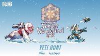
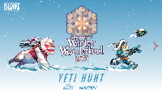
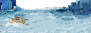
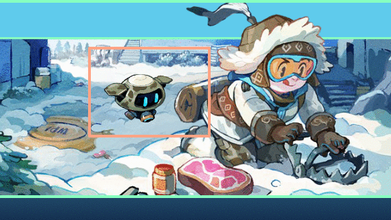

# Turbomedia example

Example of a turbomedia, adapted from this:  
  

## Manifest

*`(Original version: `[`manifest.json`](manifest.json)`)`*

{  
    "@context": "https://readium.org/webpub-manifest/context.jsonld",  
  
    "metadata": {  
        "@type": "http://schema.org/Book",  
        "title": "Yeti Hunt",  
        "identifier": "urn:madefire:OW-WW2017",  
        "language": "en",  
        "modificationDate": "2017-12-21",  
        "publicationDate": "2017-12-21",  
        "series": {  
            "name": "Overwatch"  
        },  
        "contributors": {  
            "author": [  
                {  
                    "name": "Robert Brooks"  
                }  
            ],  
            "illustrator": [  
                {  
                    "name": "onemegawatt"  
                }  
            ]  
        },  
        "publisher": {  
            "name": "Blizzard Entertainment"  
        },  
        "readingProgression": "ltr",  
        "numberOfPages": 2,  
        "position": 0,  
        "description": "According to legend, a dangerous Yeti roams the mountain peaks above Nepal. Who will be brave enough to hunt down this terrifying creature? Who will have the wits to outmaneuver its raw strength and power? Who else, but Mei and Snowball!",  
        "cover": {  
            "href": "[cover.png](cover.png) ,  
            "type": "image/png",  
            "width": 1194,  
            "height": 670  
        }  
    },  
  
    "spine": [  
        {  
            "width": 568,  
            "height": 320,  
            "fit": "both",  
            "position": "center",  
            "properties": {  
                "background": {  
                    "gradient": {  
                        "type": "linear",  
                        "start": {  
                            "x": 0.5,  
                            "y": 0  
                        },  
                        "end": {  
                            "x": 0.5,  
                            "y": 1  
                        },  
                        "colors": [  
                            {  
                                "color": "#4999c3",  
                                "location": 0  
                            },  
                            {  
                                "color": "#ffffff",  
                                "location": 1  
                            }  
                        ]  
                    }  
                      
                },  
                "transition": {  
                    "effect": "wipe",  
                    "from": "bottom",  
                    "duration": "slow"  
                }  
            },  
            "cover": {  
                "href": "[cover1.png](cover1.png) ,  
                "type": "image/png",  
                "width": 720,  
                "height": 406  
            },  
            "layers": [  
                {  
                    "width": 233,  
                    "height": 50,  
                    "path": "M 166,245",  
                    "resources": [  
                        {  
                            "type": "image/png",  
                            "href": "[images/1/92f66f3f587b997a44389fa60b8f0aab.png](images/1/92f66f3f587b997a44389fa60b8f0aab.png)   
                        }  
                    ]  
                },  
                {  
                    "width": 57,  
                    "height": 30,  
                    "path": "M 13,9",  
                    "resources": [  
                        {  
                            "type": "image/png",  
                            "href": "[images/1/6b77736f4950a8db9b0a26b064d4a06b.png](images/1/6b77736f4950a8db9b0a26b064d4a06b.png)   
                        }  
                    ]  
                },  
                {  
                    "width": 261,  
                    "height": 21,  
                    "path": "M 149,294",  
                    "resources": [  
                        {  
                            "type": "image/png",  
                            "href": "[images/1/7540eacd4812d873025115b7022d555f.png](images/1/7540eacd4812d873025115b7022d555f.png)   
                        }  
                    ]  
                },  
                {  
                    "width": 261,  
                    "height": 12,  
                    "path": "M 108,284",  
                    "resources": [  
                        {  
                            "type": "image/png",  
                            "href": "[images/1/8dbbb1d15c48267a9c740133842ef21c.png](images/1/8dbbb1d15c48267a9c740133842ef21c.png)   
                        }  
                    ]  
                },  
                {  
                    "width": 568,  
                    "height": 320,  
                    "path": "M 8,18",  
                    "resources": [  
                        {  
                            "type": "image/png",  
                            "href": "[images/1/815a07ff769db3a62a09ef018750a52a.png](images/1/815a07ff769db3a62a09ef018750a52a.png)   
                        }  
                    ],  
                    "rotation": {  
                        "z": 180  
                    }  
                },  
                {  
                    "width": 430,  
                    "height": 119,  
                    "path": "M 40,122",  
                    "resources": [  
                        {  
                            "type": "image/png",  
                            "href": "[images/1/7288a357d717405c62bb77bf9ddce0c6.png](images/1/7288a357d717405c62bb77bf9ddce0c6.png)   
                        }  
                    ]  
                },  
                {  
                    "width": 114,  
                    "height": 105,  
                    "path": "M 371,135",  
                    "resources": [  
                        {  
                            "type": "image/png",  
                            "href": "[images/1/6b984236a79244993441d78000199f14.png](images/1/6b984236a79244993441d78000199f14.png)   
                        }  
                    ],  
                    "rotation": {  
                        "z": 341  
                    }  
                },  
                {  
                    "width": 50,  
                    "height": 20,  
                    "path": "M 444,125",  
                    "resources": [  
                        {  
                            "type": "image/png",  
                            "href": "[images/1/e8190825ae6bca5348a093d9f3fd7b8e.png](images/1/e8190825ae6bca5348a093d9f3fd7b8e.png)   
                        }  
                    ],  
                    "rotation": {  
                        "z": 341  
                    }  
                },  
                {  
                    "width": 153,  
                    "height": 189,  
                    "path": "M 206,17",  
                    "resources": [  
                        {  
                            "type": "image/png",  
                            "href": "[images/1/5ed3988b3d84e301345638c6776ee33b.png](images/1/5ed3988b3d84e301345638c6776ee33b.png)   
                        }  
                    ]  
                }  
            ]  
        },  
        {  
            "width": 568,  
            "height": 320,  
            "fit": "both",  
            "position": "center",  
            "properties": {  
                "background": {  
                    "gradient": {  
                        "type": "linear",  
                        "start": {  
                            "x": 0.5,  
                            "y": 0.288919659  
                        },  
                        "end": {  
                            "x": 0.5,  
                            "y": 1  
                        },  
                        "colors": [  
                            {  
                                "color": "#5fcbec",  
                                "location": 0  
                            },  
                            {  
                                "color": "#143050",  
                                "location": 1  
                            }  
                        ]  
                    }  
                      
                },  
                "transition": {  
                    "effect": "wipe",  
                    "from": "bottom",  
                    "duration": "slow"  
                }  
            },  
            "cover": {  
                "href": "[cover2.png](cover2.png) ,  
                "type": "image/png",  
                "width": 720,  
                "height": 406  
            },  
            "layers": [  
                {  
                    "width": 635,  
                    "height": 288,  
                    "path": "M -50,0",  
                    "z-index": 5,  
                    "resources": [  
                        {  
                            "type": "image/png",  
                            "href": "[images/2/ee9c3f48feda732df77cee018d29c2b5.png](images/2/ee9c3f48feda732df77cee018d29c2b5.png)   
                        }  
                    ],  
                    "animations": [  
                        {  
                            "duration": 1000,  
                            "sequence": [  
                                {  
                                    "from": {  
                                        "opacity": 0  
                                    },  
                                    "to": {  
                                        "opacity": 1  
                                    }  
                                }  
                            ]  
                        },  
                        {  
                            "duration": 3,  
                            "sequence": [  
                                {  
                                    "from": {  
                                        "scale.x": 0.9,  
                                        "scale.y": 0.9  
                                    },  
                                    "to": {  
                                        "scale.x": 1,  
                                        "scale.y": 1  
                                    }  
                                }  
                            ]  
                        }  
                    ]  
                },  
                {  
                    "width": 634,  
                    "height": 233,  
                    "path": "M -40,54",  
                    "z-index": 1,  
                    "resources": [  
                        {  
                            "type": "image/png",  
                            "href": "[images/2/5f7963e32c8439d86e96656b800fcbf1.png](images/2/5f7963e32c8439d86e96656b800fcbf1.png)   
                        }  
                    ],  
                    "animations": [  
                        {  
                            "duration": 1000,  
                            "sequence": [  
                                {  
                                    "from": {  
                                        "opacity": 0  
                                    },  
                                    "to": {  
                                        "opacity": 1  
                                    }  
                                }  
                            ]  
                        },  
                        {  
                            "duration": 3000,  
                            "sequence": [  
                                {  
                                    "from": {  
                                        "scale.x": 0.9,  
                                        "scale.y": 0.9  
                                    },  
                                    "to": {  
                                        "scale.x": 1,  
                                        "scale.y": 1  
                                    }  
                                }  
                            ]  
                        }  
                    ]  
                },  
                {  
                    "width": 174,  
                    "height": 128,  
                    "path": "M 130,70",  
                    "z-index": 6,  
                    "resources": [  
                        {  
                            "type": "image/png",  
                            "href": "[images/2/066177f5708ae35051dfad5c95391884.png](images/2/066177f5708ae35051dfad5c95391884.png) ,  
                            "duration": 77  
                        },  
                        {  
                            "type": "image/png",  
                            "href": "[images/2/0d213ce2887518fbe8ddb3c3867babf8.png](images/2/0d213ce2887518fbe8ddb3c3867babf8.png) ,  
                            "duration": 77  
                        },  
                        {  
                            "type": "image/png",  
                            "href": "[images/2/27ec7e915cb21f1f779f00bfe7509dcd.png](images/2/27ec7e915cb21f1f779f00bfe7509dcd.png) ,  
                            "duration": 77  
                        },  
                        {  
                            "type": "image/png",  
                            "href": "[images/2/a8cc3a52a57e2d23f091b331cf8b9e9c.png](images/2/a8cc3a52a57e2d23f091b331cf8b9e9c.png) ,  
                            "duration": 77  
                        },  
                        {  
                            "type": "image/png",  
                            "href": "[images/2/c7db03ccbb6768e7ba2d64d6ce77b767.png](images/2/c7db03ccbb6768e7ba2d64d6ce77b767.png) ,  
                            "duration": 77  
                        },  
                        {  
                            "type": "image/png",  
                            "href": "[images/2/7ab2f524c2c059fd3ce2157165d7b532.png](images/2/7ab2f524c2c059fd3ce2157165d7b532.png) ,  
                            "duration": 77  
                        },  
                        {  
                            "type": "image/png",  
                            "href": "[images/2/477b5f047aa7c6b89600d64d37edd076.png](images/2/477b5f047aa7c6b89600d64d37edd076.png) ,  
                            "duration": 77  
                        },  
                        {  
                            "type": "image/png",  
                            "href": "[images/2/dd03b5d2149345323fe28b8fc17325fd.png](images/2/dd03b5d2149345323fe28b8fc17325fd.png) ,  
                            "duration": 77  
                        },  
                        {  
                            "type": "image/png",  
                            "href": "[images/2/d45fdfcfef7ac5e330a3a21a2e35e848.png](images/2/d45fdfcfef7ac5e330a3a21a2e35e848.png) ,  
                            "duration": 77  
                        },  
                        {  
                            "type": "image/png",  
                            "href": "[images/2/ba9994f8ffd1233d7b0568c16189af03.png](images/2/ba9994f8ffd1233d7b0568c16189af03.png) ,  
                            "duration": 77  
                        },  
                        {  
                            "type": "image/png",  
                            "href": "[images/2/270f9010cdd106943f021369164250fc.png](images/2/270f9010cdd106943f021369164250fc.png) ,  
                            "duration": 77  
                        },  
                        {  
                            "type": "image/png",  
                            "href": "[images/2/24fe62ee4518b1b11437b460ef360612.png](images/2/24fe62ee4518b1b11437b460ef360612.png) ,  
                            "duration": 77  
                        },  
                        {  
                            "type": "image/png",  
                            "href": "[images/2/820c09538863bab68b3e86370af1f5ae.png](images/2/820c09538863bab68b3e86370af1f5ae.png) ,  
                            "duration": 77  
                        }  
                    ],  
                    "loops": 0,  
                      
                    "animations": [  
                        {  
                            "duration": 1000,  
                            "sequence": [  
                                {  
                                    "from": {  
                                        "opacity": 0  
                                    },  
                                    "to": {  
                                        "opacity": 1  
                                    }  
                                }  
                            ]  
                        },  
                        {  
                            "sequence": [  
                                {  
                                    "from": {  
                                        "translation.x": -80,  
                                        "translation.y": -20  
                                    },  
                                    "to": {  
                                        "translation.x": -30,  
                                        "translation.y": -20  
                                    },  
                                    "duration": 1100  
                                },  
                                {  
                                    "from": {  
                                        "translation.x": -30,  
                                        "translation.y": -20  
                                    },  
                                    "to": {  
                                        "translation.x": 0,  
                                        "translation.y": 0  
                                    },  
                                    "duration": 1000  
                                }  
                            ]  
                        }  
                    ]  
                },  
                {  
                    "width": 568,  
                    "height": 233,  
                    "path": "M -27,54",  
                    "z-index": 0,  
                    "resources": [  
                        {  
                            "type": "image/jpeg",  
                            "href": "[images/2/0d547135789170241e25d6675c06e7bc.jpg](images/2/0d547135789170241e25d6675c06e7bc.jpg)   
                        }  
                    ],  
                    "animations": [  
                        {  
                            "duration": 1000,  
                            "sequence": [  
                                {  
                                    "from": {  
                                        "opacity": 0  
                                    },  
                                    "to": {  
                                        "opacity": 1  
                                    }  
                                }  
                            ]  
                        },  
                        {  
                            "duration": 3,  
                            "sequence": [  
                                {  
                                    "from": {  
                                        "scale.x": 0.9,  
                                        "scale.y": 0.9  
                                    },  
                                    "to": {  
                                        "scale.x": 1,  
                                        "scale.y": 1  
                                    }  
                                }  
                            ]  
                        }  
                    ]  
                }  
            ]  
        }  
    ],  
  
    "sections": [],  
  
    "renditions": [],  
  
    "resources": [],  
  
    "links": []  
}

---

**This gives these 2 pages (after animations):**

