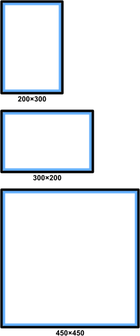
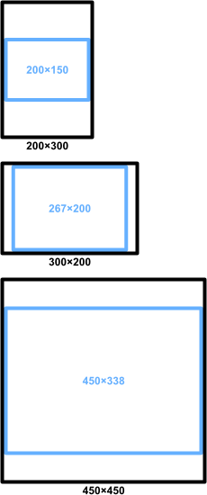
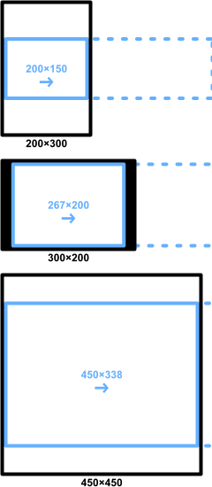

# Manifest

## Table of Contents

- [Definition](#definition)
   - [Metadata](#metadata)
   - [Entity](#entity)
   - [Link](#link)
   - [Rendition](#rendition)
   - [Section](#section)
   - [Page](#page)
   - [Background](#background)
   - [Transition](#transition)
   - [Transition resource](#transition-resource)
   - [Fragment](#fragment)
   - [Layer](#layer)
   - [SnapPoint](#Snappoint)
   - [Animation](#animation)
   - [Animation sequence](#animation-sequence)
- [Types](#types)
   - [date](#date)
   - [languageCode](#languagecode)
   - [readingProgression](#readingprogression)
   - [int](#int)
   - [uint](#uint)
   - [float](#float)
   - [ufloat](#ufloat)
   - [color](#color)
   - [percentage](#percentage)
   - [duration](#duration)
   - [boolean](#boolean)
   - [contributorType](#contributortype)
   - [linkRelationship](#linkrelationship)
   - [resourceType](#resourcetype)
   - [fragmentType](#fragmenttype)
   - [gradientType](#gradienttype)
   - [fitType](#fittype)
   - [position](#position)
   - [snap-alignment](#snap-alignment)
   - [transitionType](#transitiontype)
   - [transitionEffect](#transitioneffect)
   - [directionMask](#directionmask)
   - [spreadGroup](#spreadgroup)
   - [animationProperty](#animationproperty)
   - [timingFunction](#timingfunction)
   - [path](#path)

## Definition

{  
     "@context": "https://readium.org/webpub-manifest/context.jsonld",  

     "metadata": [**@Metadata**](#metadata),  

     "readingOrder": [  
          [**@Page**](#page)  
     ],  

     "sections": [  
          [**@Section**](#section)  
     ],  

     "renditions": [  
          [**@Rendition**](#rendition)  
     ],  

     "resources": [  
          [**@Link**](#link)  
     ],  

     "links": [  
          [**@Link**](#link)  
     ]  
}

### Metadata

{  
     "@type": "*`http://schema.org/Book` for publication or `https://bib.schema.org/Chapter` for section.*",  
     "title": "*`Publication/Chapter title`*",  
     "identifier": "*`Unique identifier as a URI`*",  
     "language": "[@languageCode](#languagecode)",  
     "modificationDate": "[@date](#date)",  
     "publicationDate": "[@date](#date)",  
     "series": {  
          "identifier": "*`Unique identifier as a URI`*"  
          "name": "*`Name of the serie`*"  
     },  
     "contributors": {  
          [@contributorType](#contributortype): [  
               [**@Entity**](#entity)  
          ]  
     },  
     "publisher": [**@Entity**](#entity),  
     "readingProgression": [@readingProgression](#readingprogression),  
     "numberOfPages": [@uint](#uint),  
     "position": [@uint](#uint),  
     "description": "*`Description of the publication/chapter`*"  
}

### Entity

{  
     "identifier": "*`Unique identifier`*",  
     "name": "*`Name of the entity (contributor or publisher), in the language of the publication`*",  
     "translations": {  
          "[@languageCode](#languagecode)": "*`Name of the entity (contributor or publisher) in the language defined by the key`*"  
     }  
}

> **Note:** *It is thus possible to display the name of the entity (contributor or publisher) in the same language as the publication, or in the language of the device if this language is provided in translations.*

### Link

{  
     "rel": [@linkRelationship](#linkrelationship),  
     "type": [@resourceType](#resourcetype),  
     "href": "*`Path to resource`*",  
     "width": [@uint](#uint),  
     "height": [@uint](#uint)  
}

### Rendition

{  
     "metadata": [**@Metadata**](#metadata),  
     "readingOrder": [  
          [**@Page**](#page)  
     ],  
     "sections": [  
          [**@Section**](#section)  
     ],  
     "resources": [  
          [**@Link**](#link)  
     ],  
     "links": [  
          [**@Link**](#link)  
     ]  
}

### Section

{  
     "metadata": [**@Metadata**](#metadata),  
     "readingOrder": [  
          [**@Page**](#page)  
     ],  
     "resources": [  
          [**@Link**](#link)  
     ],  
     "links": [  
          [**@Link**](#link)  
     ]  
}

### Page

{  
     "identifier": "*`Identifier`*",  
     "width": [@uint](#uint),  
     "height": [@uint](#uint),  
     "fit": [@fitType](#fittype),  
     "position-x": [@position](#position),  
     "position-y": [@position](#position),  
     "content": {  
          "type": [@resourceType](#resourcetype),  
          "href": "*`Path to resource`*",  
          "width": [@uint](#uint),  
          "height": [@uint](#uint),  
          "fit": [@fitType](#fittype),  
          "position-x": [@position](#position),  
          "position-y": [@position](#position)  
     },  
     "properties": {  
          [@transitionType](#transitiontype): [**@Transition**](#transition),  
          "structure": [  
               [**@Fragment**](#fragment)  
          ],  
          "spread": {  
               "index": [@uint](#uint),  
               "group": [@spreadGroup](#spreadgroup)  
          },  
          "snap-points": [  
               [**@SnapPoint**](#snappoint)  
          ],  
          "background": [@color](#color),   `or `[**`@Background`**](#background)`?`  
          "links": [  
               [**@Link**](#link)    *`Only links of type "alternate" are valid. They provide fallback/poster for this page.`*  
          ]  
     },  
     "layers": [  
          [**@Layer**](#layer)  
     ]  
}

**Note:**  
At the page level, `width`, `height`, `fit` and `position` define the reader viewport. If not specified, the viewport is the device window.  
The combination of these values determines if the page is scrollable and if yes, the direction of the scroll.  
  
Examples:  

 |  | 
---|---|---
Page: { }  |  Page: {     "width": 400,     "height": 300,     "fit": "both",     "position-x": "center",     "position-y": "center" }  |  Page: {     "width": 1000,     "height": 300,     "fit": "4:3",     "position-x": "start",     "position-y": "center" }

### Background

{  
     "color": [@color](#color),  
     "gradient": {  
          "type": [@gradientType](#gradienttype),  
          "start": {  
               "x": [@percentage](#percentage),  
               "y": [@percentage](#percentage)  
          },  
          "end": {  
               "x": [@percentage](#percentage),  
               "y": [@percentage](#percentage)  
          },  
          "colors": [  
               {  
                    "color": [@color](#color),  
                    "location": [@percentage](#percentage)  
               }  
          ],  
     }  
}  

### Transition

{  
     "effect": [@transitionEffect](#transitioneffect),  
     "from": [@directionMask](#directionMask),  
     "duration": [@duration](#duration),  
     "timing-function": [@timingFunction](#timingfunction),  
     "controllable": [@boolean](#boolean),  
     "unique": [@boolean](#boolean),  
     "resources": [  
          [**@TransitionResource**](#transition-resource)  
     ]  
}

### Transition resource

{  
     "href": "*`Path to resource`*",  
     "type": [@resourceType](#resourcetype),  
     "width": [@uint](#uint),  
     "height": [@uint](#uint),  
     "x": [@ufloat](#ufloat),  
     "y": [@ufloat](#ufloat)  
}

### Fragment

{  
     "path": [@path](#path),  
     "type": [@fragmentType](#fragmenttype)  
}

### Layer

{  
     "width": [@ufloat](#ufloat),  
     "height": [@ufloat](#ufloat),  
     "speed": [@float](#float),  
     "opacity": [@percentage](#percentage),  
     "rotation": {  
          "x": [@float](#float),  
          "y": [@float](#float),  
          "z": [@float](#float)  
     },  
     "scale": {  
          "x": [@ufloat](#ufloat),  
          "y": [@ufloat](#ufloat)  
     },  
     "z-index": [@int](#int),  
     "path": "[@path](#path)",  
     "resources": [  
          {  
               "type": [@resourceType](#resourcetype),  
               "href": "*`Path to resource`*",  
               "duration": [@duration](#duration)  
          }  
     ],  
     "loops": [@uint](#uint),    `Default: 1 (no repeat)`  
     "background": [@color](#color),   `or `[**`@Background`**](#background)`?`  
     "animations": [  
          [**@Animation**](#animation)  
     ]  
}

### SnapPoint

{  
     "identifier": "*`Identifier`*",  
     "x": [@ufloat](#ufloat),  
     "y": [@ufloat](#ufloat),  
     "alignment": [@snap-alignment](#snap-alignment)  
}

### Animation

{  
     "start": {  
          "position": {  
               "x": [@ufloat](#ufloat),  
               "y": [@ufloat](#ufloat)  
          },  
          "delay": [@duration](#duration),  
          "snap-point": "*`Snap point identifier`*"  
     },  
     "end": {  
          "x": [@ufloat](#ufloat),  
          "y": [@ufloat](#ufloat)  
     },  
     "duration": [@duration](#duration),  
     "timing-function": [@timingFunction](#timingfunction),  
     "sequence": [  
          [**@Animation-sequence**](#animation-sequence)  
     ],  
     "loops": [@uint](#uint)  
}

### Animation sequence

{  
     "from": {  
          [@animationProperty](#animationproperty): *[`Defined by the corresponding property`](#animationproperty)*  
     },  
     "to": {  
          [@animationProperty](#animationproperty): *[`Defined by the corresponding property`](#animationproperty)*  
     },  
     "duration": [@duration](#duration),  
     "timing-function": [@timingFunction](#timingfunction)  
}

## Types

#### `date`

[W3C Date time](https://www.w3.org/TR/NOTE-datetime) (expressed in UTC), e.g. `YYYY-MM-DDThh:mm:ss.sTZD`, where:  
- `YYYY` = four-digit year
- `MM` = two-digit month (01=January, etc.)
- `DD` = two-digit day of month (01 through 31)
- `hh` = two digits of hour (00 through 23) (am/pm NOT allowed)
- `mm` = two digits of minute (00 through 59)
- `ss` = two digits of second (00 through 59)
- `s`  = one or more digits representing a decimal fraction of a second
- `TZD` = time zone designator (Z or +hh:mm or -hh:mm)

#### `languageCode`

Language code in ISO 639-1 format.

#### `readingProgression`

- "`ltr`": Left to right
- "`rtl`": Right to left
- "`ttb`": Top to bottom
- "`btt`": Bottom to top

#### `int`

Integer.

#### `uint`

Positive integer.

#### `float`

Float.

#### `ufloat`

Positive float.

#### `color`

String in format: "`#RRGGBB`" (`RR`, `GG` and `BB` are hexadecimal values).

#### `percentage`

Float in interval [0, 1].

#### `duration`

Positive integer representing a duration in ms.  
Or "slow" or "fast" (these special values depend on the choice of the reader implementation).

#### `boolean`

- `true`
- `false`

#### `contributorType`

- "`author`"
- "`translator`"
- "`editor`"
- "`illustrator`"
- "`artist`"
- "`colorist`"
- "`inker`"
- "`penciler`"
- "`letterer`"
- "`narrator`"

#### `linkRelationship`

- "`alternate`"
- "`contents`"
- "`cover`"
- "`manifest`"

#### `resourceType`

Image types:

- "`image/png`"
- "`image/jpeg`"

#### `fragmentType`

- "`panel`"
- "`text`"

#### `gradientType`

- "`linear`"
- "`radial`"

#### `fitType`

- "`width`"
- "`height`"
- "`both`": This corresponds to the notion of "aspect fit".
- "`fill`": The fit is done on one dimension, the other one is cropped.

*Ratio types:*
- "[`@uint`](#uint)`:`[`@uint`](#uint)": Exact ratio to display. Example: `4:3`.
- "[`@uint`](#uint)`:`[`@uint`](#uint)`-`[`@uint`](#uint)`:`[`@uint`](#uint)": Min ratio and max ratio. Example: `1:1-4:3`. The min or the max ratio can be omitted to just define one of the 2 bounds. Example: `1:1-` (min "1:1" ratio) or `-4:3` (max "4:3" ratio).

#### `position`

- "`start`"
- "`end`"
- "`center`"

> **Note:** The default position is `start`.

#### `snap-alignment`

- "`none`"
- "`start`"
- "`end`"
- "`center`"

#### `transitionType`

- "`transition`": Transition effect between current page and next page.
- "`transition-forward`": Transition effect from this page to next page.
- "`transition-backward`": Transition effect from next page to this page.

#### `transitionEffect`

- "`crossfade`": The next page fades in as the current page fades out.
- "`push`": The next page appears first on a corner, right, left, top or bottom, then pushes the current page to the other corner.
- "`wipe`": The next page appears first on a corner, right, left, top or bottom, then spreads to the other corner, as the current slide fades.
- "`split`": The next page appears first on the center, on a vertical or horizontal axis, then spreads to the corners, as the current slide fades.
- "`images`": A sequence of image resources are displayed between the current and next page.

#### `directionMask`

Combination of these terms, separated by `|`:
- "`left`"
- "`right`"
- "`top`""
- "`bottom`"

#### `spreadGroup`

- "`always`"
- "`if_possible`"
- "`never`"

#### `animationProperty`

- "`opacity`"
   - The value of this property must have the type [@percentage](#percentage)

*Scale properties:*
- "`scale.x`"
   - The value of this property must have the type [@ufloat](#ufloat)
- "`scale.y`"
   - The value of this property must have the type [@ufloat](#ufloat)

*Rotation properties:*
- "`rotation.x`"
   - The value of this property must have the type [@float](#float)
- "`rotation.y`"
   - The value of this property must have the type [@float](#float)
- "`rotation.z`"
   - The value of this property must have the type [@float](#float)

*Translation properties:*
- "`translation.x`"
   - The value of this property must have the type [@float](#float)
- "`translation.y`"
   - The value of this property must have the type [@float](#float)

#### `timingFunction`

See https://easings.net/.

- "`linear`"

*Ease-in functions:*

- "`easeInSine`"
- "`easeInQuad`"
- "`easeInCubic`"
- "`easeInQuart`"
- "`easeInQuint`"
- "`easeInExpo`"
- "`easeInCirc`"
- "`easeInBack`"

*Ease-out functions:*

- "`easeOutSine`"
- "`easeOutQuad`"
- "`easeOutCubic`"
- "`easeOutQuart`"
- "`easeOutQuint`"
- "`easeOutExpo`"
- "`easeOutCirc`"
- "`easeOutBack`"

*Ease-in-out functions:*

- "`easeInOutSine`"
- "`easeInOutQuad`"
- "`easeInOutCubic`"
- "`easeInOutQuart`"
- "`easeInOutQuint`"
- "`easeInOutExpo`"
- "`easeInOutCirc`"
- "`easeInOutBack`"

#### `path`

Sequence of:

  Command  |  Description  
-----------|---------------  
`M` `x`:[@ufloat](#ufloat)`,y`:[@ufloat](#ufloat)  |  Absolute move to (`x`, `y`) points.  
`L` *\(*`x`:[@ufloat](#ufloat)`,y`:[@ufloat](#ufloat)*\)+*  |  Absolute line from current point to (`x`, `y`) points.  
`l` *\(*`x`:[@float](#float)`,y`:[@float](#float)*\)+*  |  Relative line from current point to (`x`, `y`) points.  
`H` *\(*`x`:[@ufloat](#ufloat)*\)+*  |  Absolute horizontal line from current point to `x` coordinate.  
`h` *\(*`x`:[@float](#float)*\)+*  |  Relative horizontal line from current point to `x` coordinate.  
`V` *\(*`y`:[@ufloat](#ufloat)*\)+*  |  Absolute vertical line from current point to `y` coordinate.  
`v` *\(*`y`:[@float](#float)*\)+*  |  Relative vertical line from current point to `y` coordinate.  
`C` *\(*`x1`:[@ufloat](#ufloat)`,y1`:[@ufloat](#ufloat)` x2`:[@ufloat](#ufloat)`,y2`:[@ufloat](#ufloat)` x`:[@ufloat](#ufloat)`,y`:[@ufloat](#ufloat)*\)+*  |  Cubic Bézier curve from the current point to absolute point (`x`, `y`), using (`x1`, `y1`) as the absolute control point at the beginning of the curve and (`x2`, `y2`) as the absolute control point at the end of the curve.  
`c` *\(*`x1`:[@float](#float)`,y1`:[@float](#float)` x2`:[@float](#float)`,y2`:[@float](#float)` x`:[@float](#float)`,y`:[@float](#float)*\)+*  |  Cubic Bézier curve from the current point to relative point (`x`, `y`), using (`x1`, `y1`) as the relative control point at the beginning of the curve and (`x2`, `y2`) as the relative control point at the end of the curve.  
`Z`  |  Line to the initial point (same as "`z`").  
`z`  |  Line to the initial point (same as "`Z`").  

**Note:**  
A path must start with an `M` command (and cannot contains other `M` commands).