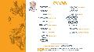

`(Original version: `[`eea3cbd0ae707e6c91f064027ee40524.json`](eea3cbd0ae707e6c91f064027ee40524.json)`)`

{  
  "elements": {  
    "69b7662ffb9d4a57ac8215c6af995b76": {  
      "opacity": 1,  
      "scale": {  
        "y": 1,  
        "x": 1  
      },  
      "rotation": {  
        "y": 0,  
        "x": 0,  
        "z": 0  
      },  
      "name": "background",  
      "type": "container",  
      "clickUrl": null,  
      "mask": null,  
      "clipToBounds": true,  
      "children": null,  
      "zIndex": -1,  
      "margin": {  
        "top": 0,  
        "right": 0,  
        "bottom": 0,  
        "left": 0  
      },  
      "altText": null,  
      "isRotated": false,  
      "background": {  
        "color": "0x00000000",  
        "gradient": null  
      },  
      "offset": {  
        "y": 0,  
        "x": 0,  
        "z": 0  
      },  
      "dropShadow": null,  
      "hidden": false,  
      "clickColor": null,  
      "border": {  
        "color": "0x00000000",  
        "gradient": null,  
        "radius": 0,  
        "thickness": 0  
      },  
      "id": "69b7662ffb9d4a57ac8215c6af995b76"  
    },  
    "3e4c35153a3e409d98845186e2ae82fe": {  
      "opacity": 1,  
      "scale": {  
        "y": 1,  
        "x": 1  
      },  
      "rotation": {  
        "y": 0,  
        "x": 0,  
        "z": 0  
      },  
      "name": "MERLON MASTER COLOR copy",  
      "type": "container",  
      "clickUrl": null,  
      "mask": {  
        "id": "40f39aa1ce1347c6ac5a3b579cc78a11"  
      },  
      "clipToBounds": true,  
      "children": null,  
      "zIndex": 7,  
      "margin": {  
        "top": 238,  
        "right": 0,  
        "bottom": 0,  
        "left": 408  
      },  
      "altText": null,  
      "isRotated": false,  
      "background": {  
        "color": "0x495f72ff",  
        "gradient": null  
      },  
      "offset": {  
        "y": 0,  
        "x": 0,  
        "z": 0  
      },  
      "dropShadow": null,  
      "hidden": false,  
      "clickColor": "0xe20f1cff",  
      "border": {  
        "color": "0x00000000",  
        "gradient": null,  
        "radius": 0,  
        "thickness": 0  
      },  
      "id": "3e4c35153a3e409d98845186e2ae82fe"  
    },  
    "c1dc053458c7449b880098f8cc37a812": {  
      "altText": null,  
      "alphaMask": null,  
      "clickUrl": null,  
      "clickColor": "0xe20f1cff",  
      "border": {  
        "color": "0x00000000",  
        "gradient": null,  
        "radius": 0,  
        "thickness": 0  
      },  
      "id": "c1dc053458c7449b880098f8cc37a812",  
      "scale": {  
        "y": 1,  
        "x": 1  
      },  
      "imageAlignment": "center",  
      "clipToBounds": true,  
      "children": null,  
      "alphaMask2x": null,  
      "hidden": false,  
      "type": "image",  
      "opacity": 1,  
      "src2x": "[9570b611200528b6953898c9e4e105aa.jpg](9570b611200528b6953898c9e4e105aa.jpg)" ,  
      "sprite": null,  
      "imageOffset": null,  
      "zIndex": 2,  
      "background": {  
        "color": "0x00000000",  
        "gradient": null  
      },  
      "offset": {  
        "y": 0,  
        "x": 0,  
        "z": 0  
      },  
      "imageScale": {  
        "mode": "aspect-fit",  
        "value": 1  
      },  
      "rotation": {  
        "y": 0,  
        "x": 0,  
        "z": 0  
      },  
      "src": "[0b62d21baed557fd9c69f7bacd970fb2.jpg](0b62d21baed557fd9c69f7bacd970fb2.jpg)" ,  
      "name": "OW DOOM CREDITS",  
      "colorMode": "RGB",  
      "mask": null,  
      "isRotated": false,  
      "dropShadow": null,  
      "margin": {  
        "top": 0,  
        "right": 0,  
        "bottom": 0,  
        "left": 0  
      }  
    },  
    "427208b1d587446e80affb2faab8858e": {  
      "src": "[23d83ac47a8021e79c47c6f146faf8d4.mp3](23d83ac47a8021e79c47c6f146faf8d4.mp3)",  
      "altText": null,  
      "name": "1 MUSIC",  
      "volume": 0,  
      "panning": 0,  
      "loops": 0,  
      "type": "sound",  
      "id": "427208b1d587446e80affb2faab8858e"  
    },  
    "c09531799ac34bcbbfde3697f13e5472": {  
      "src": "[89f821b469ec141d9eb75a9825b9bbc6.mp3](89f821b469ec141d9eb75a9825b9bbc6.mp3)",  
      "altText": null,  
      "name": "1 MUSIC",  
      "volume": 1,  
      "panning": 0,  
      "loops": 0,  
      "type": "sound",  
      "id": "c09531799ac34bcbbfde3697f13e5472"  
    },  
    "b7893304a7274e4e9c51ddbcfd241794": {  
      "altText": null,  
      "alphaMask": null,  
      "clickUrl": null,  
      "clickColor": "0xe20f1cff",  
      "border": {  
        "color": "0x00000000",  
        "gradient": null,  
        "radius": 0,  
        "thickness": 0  
      },  
      "id": "b7893304a7274e4e9c51ddbcfd241794",  
      "scale": {  
        "y": 1,  
        "x": 1  
      },  
      "imageAlignment": "center",  
      "clipToBounds": true,  
      "children": null,  
      "alphaMask2x": null,  
      "hidden": false,  
      "type": "image",  
      "opacity": 1,  
      "src2x": "[4758a80418e941ca6f1a3afe7ca6c371.jpg](4758a80418e941ca6f1a3afe7ca6c371.jpg)" ,  
      "sprite": null,  
      "imageOffset": null,  
      "zIndex": 1,  
      "background": {  
        "color": "0x00000000",  
        "gradient": null  
      },  
      "offset": {  
        "y": 0,  
        "x": 0,  
        "z": 0  
      },  
      "imageScale": {  
        "mode": "aspect-fit",  
        "value": 1  
      },  
      "rotation": {  
        "y": 0,  
        "x": 0,  
        "z": 0  
      },  
      "src": "[9ff4d2d8d25d82753091c8e420cc597a.jpg](9ff4d2d8d25d82753091c8e420cc597a.jpg)" ,  
      "name": "image",  
      "colorMode": "RGB",  
      "mask": null,  
      "isRotated": false,  
      "dropShadow": null,  
      "margin": {  
        "top": 0,  
        "right": 0,  
        "bottom": 0,  
        "left": 0  
      }  
    },  
    "40f39aa1ce1347c6ac5a3b579cc78a11": {  
      "altText": null,  
      "alphaMask": null,  
      "clickUrl": null,  
      "clickColor": "0xe20f1cff",  
      "border": {  
        "color": "0x00000000",  
        "gradient": null,  
        "radius": 0,  
        "thickness": 0  
      },  
      "id": "40f39aa1ce1347c6ac5a3b579cc78a11",  
      "scale": {  
        "y": 1,  
        "x": 1  
      },  
      "imageAlignment": "center",  
      "clipToBounds": true,  
      "children": null,  
      "alphaMask2x": null,  
      "hidden": false,  
      "type": "image",  
      "opacity": 0,  
      "src2x": "[690507774212899576badc6d54b2a4ec.png](690507774212899576badc6d54b2a4ec.png)" ,  
      "sprite": null,  
      "imageOffset": null,  
      "zIndex": 5,  
      "background": {  
        "color": "0x00000000",  
        "gradient": null  
      },  
      "offset": {  
        "y": 0,  
        "x": 0,  
        "z": 0  
      },  
      "imageScale": {  
        "mode": "aspect-fit",  
        "value": 1  
      },  
      "rotation": {  
        "y": 0,  
        "x": 0,  
        "z": 0  
      },  
      "src": "[e4f8d94353dd9179babed6e2af92e260.png](e4f8d94353dd9179babed6e2af92e260.png)" ,  
      "name": "MERLON 0003 MASTER copy",  
      "colorMode": "RGBA",  
      "mask": null,  
      "isRotated": false,  
      "dropShadow": null,  
      "margin": {  
        "top": 238,  
        "right": -54,  
        "bottom": -3,  
        "left": 587  
      }  
    }  
  },  
  "name": "OW EP019 CREDITS DEV002 SND Phone",  
  "firstSequence": "220e62721ac14db89abb52cc21f66e25",  
  "previewImages": {  
    "160x90": {  
      "src": "[cf09c9a8b4b0dc3ff4b9b2e27705d324.jpg](cf09c9a8b4b0dc3ff4b9b2e27705d324.jpg)" ,  
      "id": "2576f450ff02405486fafdd8c3645d91",  
      "size": "160x90"  
    }  
  },  
  "next": "0fc8a039fa644cc80cd6e1007ba064f2",  
  "camera": null,  
  "sequences": {  
    "220e62721ac14db89abb52cc21f66e25": {  
      "commands": {  
        "bf41d3550cb64b0bb1fcd0ca8ba0c37b": {  
          "end": {  
            "volume": 0  
          },  
          "target": {  
            "type": "element",  
            "id": "427208b1d587446e80affb2faab8858e"  
          },  
          "next": null,  
          "start": {  
            "volume": 0  
          },  
          "duration": 100,  
          "easing": {  
            "type": "linear"  
          },  
          "type": "animate",  
          "id": "bf41d3550cb64b0bb1fcd0ca8ba0c37b",  
          "name": "fade in 1 MUSIC"  
        },  
        "7835f112da664a8ea93b45233ed27b06": {  
          "end": {  
            "volume": 1  
          },  
          "target": {  
            "type": "element",  
            "id": "c09531799ac34bcbbfde3697f13e5472"  
          },  
          "next": null,  
          "start": {  
            "volume": 0  
          },  
          "duration": 100,  
          "easing": {  
            "type": "linear"  
          },  
          "type": "animate",  
          "id": "7835f112da664a8ea93b45233ed27b06",  
          "name": "fade in 1 MUSIC"  
        },  
        "1c0229da36fb43529ab50348407d5bc5": {  
          "duration": 200,  
          "type": "delay",  
          "id": "1c0229da36fb43529ab50348407d5bc5",  
          "name": "delay for tap point",  
          "next": "41507c2609ab4c2a805b8317b95cbd92"  
        },  
        "ac3459a9de464effb99d0a64b05be9cd": {  
          "target": {  
            "type": "element",  
            "id": "427208b1d587446e80affb2faab8858e"  
          },  
          "next": "bf41d3550cb64b0bb1fcd0ca8ba0c37b",  
          "duration": 0,  
          "type": "start-sound",  
          "id": "ac3459a9de464effb99d0a64b05be9cd",  
          "name": "fade in 1 MUSIC start"  
        },  
        "05376b0340514eedaa4f892d1d60879f": {  
          "name": "auto-grouping 1",  
          "id": "05376b0340514eedaa4f892d1d60879f",  
          "next": "1c0229da36fb43529ab50348407d5bc5",  
          "duration": 2400,  
          "type": "group",  
          "children": [  
            "2a6a8e1871e94d7397b9141dd180db14",  
            "562ce81359fc4485aa0f2b001ee30701"  
          ]  
        },  
        "2a6a8e1871e94d7397b9141dd180db14": {  
          "end": {  
            "offset": {  
              "x": -146.666672  
            },  
            "offset.x": -146.666672  
          },  
          "target": {  
            "type": "element",  
            "id": "40f39aa1ce1347c6ac5a3b579cc78a11"  
          },  
          "next": null,  
          "start": {  
            "offset": {  
              "x": 0  
            },  
            "offset.x": 0  
          },  
          "duration": 2400,  
          "easing": {  
            "type": "quadratic-out"  
          },  
          "type": "animate",  
          "id": "2a6a8e1871e94d7397b9141dd180db14",  
          "name": "move MERLON 0003 MASTER copy move x"  
        },  
        "41507c2609ab4c2a805b8317b95cbd92": {  
          "duration": 0,  
          "type": "pause",  
          "id": "41507c2609ab4c2a805b8317b95cbd92",  
          "name": "tap point",  
          "next": null  
        },  
        "dae846ed493e4a509e37d160b4a773d5": {  
          "name": "auto-grouping 0",  
          "id": "dae846ed493e4a509e37d160b4a773d5",  
          "next": "b3b8b4d91b434ce3a4da582d4fc8418a",  
          "duration": 100,  
          "type": "group",  
          "children": [  
            "ac3459a9de464effb99d0a64b05be9cd",  
            "203820330c904bdeacca334ed2e9752c"  
          ]  
        },  
        "b3b8b4d91b434ce3a4da582d4fc8418a": {  
          "duration": 100,  
          "type": "delay",  
          "id": "b3b8b4d91b434ce3a4da582d4fc8418a",  
          "name": "delay for auto-grouping 1",  
          "next": "05376b0340514eedaa4f892d1d60879f"  
        },  
        "562ce81359fc4485aa0f2b001ee30701": {  
          "duration": 1200,  
          "type": "delay",  
          "id": "562ce81359fc4485aa0f2b001ee30701",  
          "name": "delay for fade in MERLON 0003 MASTER copy",  
          "next": "f764cf74b5074f9a8b1761960382c482"  
        },  
        "203820330c904bdeacca334ed2e9752c": {  
          "target": {  
            "type": "element",  
            "id": "c09531799ac34bcbbfde3697f13e5472"  
          },  
          "next": "7835f112da664a8ea93b45233ed27b06",  
          "duration": 0,  
          "type": "start-sound",  
          "id": "203820330c904bdeacca334ed2e9752c",  
          "name": "fade in 1 MUSIC start"  
        },  
        "f764cf74b5074f9a8b1761960382c482": {  
          "end": {  
            "opacity": 1  
          },  
          "target": {  
            "type": "element",  
            "id": "40f39aa1ce1347c6ac5a3b579cc78a11"  
          },  
          "next": null,  
          "start": {  
            "opacity": 0  
          },  
          "duration": 400,  
          "easing": {  
            "type": "linear"  
          },  
          "type": "animate",  
          "id": "f764cf74b5074f9a8b1761960382c482",  
          "name": "fade in MERLON 0003 MASTER copy"  
        }  
      },  
      "name": "sequence 0",  
      "firstCommand": "dae846ed493e4a509e37d160b4a773d5",  
      "until": null,  
      "next": null,  
      "id": "220e62721ac14db89abb52cc21f66e25"  
    }  
  },  
  "constrainPageToBounds": null,  
  "id": "e9be25121c2aed585f066476ec4d55d6",  
  "view": {  
    "y": 0,  
    "x": 0,  
    "width": 568,  
    "height": 320  
  }  
}  